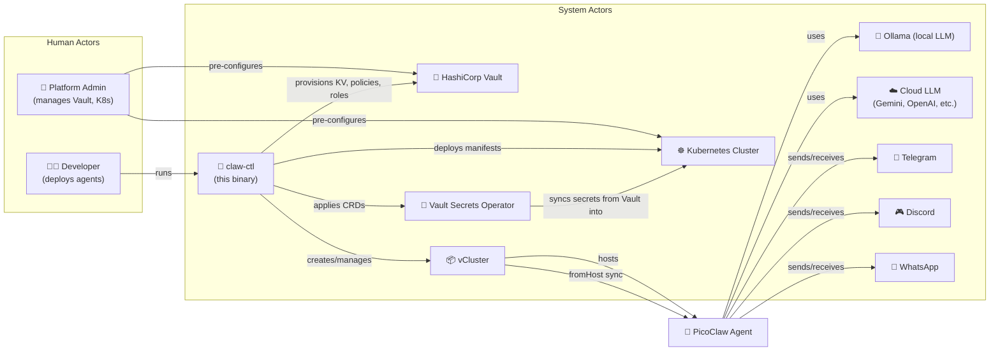

# `claw-ctl` — Solution Design

## Prerequisites

> [!IMPORTANT]
> **The only hard requirement to use `claw-ctl` is an LLM provider token or a local Ollama address.** Everything else is optional or handled by the CLI.

| Requirement | Required? | Examples |
|---|---|---|
| **LLM Access** | ✅ Mandatory | `GEMINI_API_KEY`, `OPENAI_API_KEY`, or `http://192.168.1.100:11434` (Ollama) |
| Kubeconfig | ✅ Yes | Uses `~/.kube/config` |
| `vcluster` CLI | ✅ Yes | v0.30+ |
| `kubectl` | ✅ Yes | For manifest operations |
| Vault + VSO | Optional | Only if `--vault` flag is used |
| Channel tokens | Optional | Only if Telegram/WhatsApp/Discord channels are enabled |

---

## Actors



---

## CLI Commands

| Command | Description | Idempotent |
|---|---|---|
| `claw-ctl init` | Interactive wizard (preset or custom) | N/A |
| `claw-ctl deploy <name> --preset <p>` | Deploy from preset | ✅ |
| `claw-ctl deploy --config picoclaw.yaml` | Deploy from saved config | ✅ |
| `claw-ctl deploy <name> --vault` | Deploy with Vault integration | ✅ |
| `claw-ctl destroy <name>` | Full teardown (vCluster + NS) | ✅ |
| `claw-ctl reload <cluster> [agent]` | Hot-reload workspace files via ConfigMaps | ✅ |
| `claw-ctl status <name>` | Agent health, pod status | N/A |
| `claw-ctl presets` | List available presets | N/A |

### Global Flags

| Flag | Env Var | Description |
|---|---|---|
| `--config` | — | Config file (default: picoclaw.yaml) |
| `--vault` | — | Enable Vault integration (boolean) |
| `--vault-addr` | `VAULT_ADDR` | Vault server address (override) |
| `--vault-token` | `VAULT_TOKEN` | Vault authentication token (override) |
| `--ollama-addr` | `OLLAMA_ADDR` | Ollama server address (e.g. `http://192.168.28.9:11434`) |

### Deploy Flags

| Flag | Description |
|---|---|
| `--preset` | Use a built-in preset configuration |
| `--agents` | Comma-separated list of agent names |
| `--model` | LLM model (overrides preset default) |
| `--channels` | Comma-separated channels: `telegram,discord,whatsapp` |
| `--env-file` | Path to `.env` file for secrets |

---

## Presets

| Preset | Agents | Model | Channels | Use Case |
|---|---|---|---|---|
| `financial-controller` | agent-financiero | qwen2.5-coder:14b | Telegram+HTTP | Expenses, budgets |
| `devops-engineer` | agent-devops | qwen2.5-coder:14b | Discord+HTTP | K8s, CI/CD |
| `personal-assistant` | agent-assistant | llama3.1:8b | Telegram+WhatsApp | Calendar, notes |
| `multi-team` | 3 agents | mixed | All | Full autonomous team |
| `minimal` | agent | llama3.1:8b | HTTP only | API-only agent |
| `custom` | — | — | — | Full manual wizard |

Presets are embedded YAML in the binary via `go:embed`.

---

## Deployment Lifecycle

```mermaid
sequenceDiagram
    participant User
    participant CLI as claw-ctl
    participant K8s as Host K8s
    participant VC as vCluster
    participant Vault as Vault (optional)
    participant VSO as VSO (optional)

    User->>CLI: claw-ctl deploy finance --preset financial-controller --vault

    rect rgb(40, 40, 60)
    Note over CLI,K8s: Phase 1: Infrastructure
    CLI->>K8s: Verify kubeconfig connectivity
    CLI->>K8s: Create namespace vcluster-finance (idempotent)
    end

    rect rgb(40, 60, 40)
    Note over CLI,VC: Phase 2: vCluster
    CLI->>VC: vcluster create finance (idempotent, reuses if exists)
    CLI->>VC: Wait for pod readiness (3min timeout)
    Note over CLI: If --vault: pass values.yaml with<br/>sync.fromHost.secrets.mappings.byName
    end

    alt Vault Mode (--vault)
        rect rgb(60, 50, 40)
        Note over CLI,Vault: Phase 3a: Vault Provisioning
        loop For each agent
            CLI->>Vault: Check if KV path exists (GET)
            CLI->>Vault: Create KV path with placeholders (if new)
            CLI->>Vault: Create ACL policy (read-only)
            CLI->>Vault: Create K8s auth role (bound to default SA)
            CLI->>K8s: Apply VaultConnection CR
            CLI->>K8s: Apply VaultAuth CR
            CLI->>K8s: Apply VaultStaticSecret CR
        end
        Note over VSO: VSO reads CRDs → creates K8s Secret
        Note over VC: vCluster syncs secret from host → virtual
        end
    else .env Mode
        rect rgb(50, 60, 40)
        Note over CLI,K8s: Phase 3b: Native Secrets
        loop For each agent
            CLI->>K8s: EnsureSecret (create-or-update)
        end
        end
    end

    rect rgb(50, 40, 60)
    Note over CLI,VC: Phase 4: Agent Manifests
    loop For each agent
        CLI->>CLI: Render templates (NS, RBAC, PVC, ConfigMap, Workspace, Deployment, Service, Ingress)
        CLI->>VC: vcluster connect -- kubectl apply -f rendered.yaml
    end
    end

    Note over User: ✅ All agents running
```



---

## Vault Integration Flow

When `--vault` is used, `resolveVaultConfig` resolves address and token with this priority:

```
1. CLI flags (--vault-addr, --vault-token)
2. Environment variables (VAULT_ADDR, VAULT_TOKEN)
3. .env file (if --env-file is specified)
```

### Ollama Address Resolution

`resolveOllamaAddr` resolves the Ollama server address with this priority:

```
1. CLI flag (--ollama-addr)
2. Environment variable (OLLAMA_ADDR)
3. .env file (if --env-file is specified)
4. Template default (http://ollama.default.svc:11434/v1)
```

### Vault API Operations (via net/http, no SDK)

| Operation | Vault API | Idempotent |
|---|---|---|
| Enable KV v2 | `POST /v1/sys/mounts/secret` | ✅ (400 if exists) |
| Write KV secrets | `POST /v1/secret/data/agents/<cluster>/<agent>` | ✅ (skips if exists) |
| Create ACL policy | `PUT /v1/sys/policies/acl/picoclaw-<cluster>-<agent>` | ✅ (overwrites) |
| Create K8s auth role | `POST /v1/auth/kubernetes/role/picoclaw-<cluster>-<agent>` | ✅ (overwrites) |

### VSO CRDs Created (in host namespace)

| CRD | Name | Purpose |
|---|---|---|
| `VaultConnection` | `picoclaw-vault` | Points to `http://vault.vault.svc:8200` |
| `VaultAuth` | `picoclaw-<agent>` | K8s auth method with agent's Vault role |
| `VaultStaticSecret` | `picoclaw-<agent>-secret` | Pulls from KV v2, creates K8s Secret `<agent>-secret` |

### Secret Sync Chain

```
Vault KV → VSO → K8s Secret (host NS) → vCluster fromHost sync → Pod envFrom
```

> **Force re-sync:** Every `deploy --vault` deletes the existing K8s Secret before VSO recreates it, ensuring the latest Vault data is always used.

### Config Variable Resolution (envsubst)

PicoClaw reads `config.json` literally — no `${VAR}` expansion. An **init container** (`config-resolver`) runs `envsubst` to replace `${TELEGRAM_BOT_TOKEN}`, `${GEMINI_API_KEY}`, etc. with actual values from the K8s Secret before PicoClaw starts.

### Config Hash Auto-Restart

A SHA256 hash of the rendered ConfigMap is added as `claw-ctl/config-hash` annotation on the pod template. When config changes (model, ollama-addr, channels), the hash changes and Kubernetes triggers an automatic rollout.

---

## What the CLI Generates (per agent)

All manifests are **embedded Go templates** rendered dynamically per agent config:

| Template | Purpose |
|---|---|
| `namespace.yaml` | `agents` NS inside vCluster |
| `rbac.yaml.tmpl` | SA + Crystal Wall Role (deny secrets read) |
| `pvc.yaml.tmpl` | Workspace persistence |
| `configmap.yaml.tmpl` | `config.json` (model, model_name, channels, api_base) + `mcp_config.json` |
| `workspace-configmap.yaml.tmpl` | SOUL.md, IDENTITY.md, USER.md, AGENT.md, ENVIRONMENT.md |
| `deployment.yaml.tmpl` | PicoClaw container + envsubst init container + configHash annotation |
| `service.yaml.tmpl` | ClusterIP for gateway |
| `ingress.yaml.tmpl` | Traefik ingress |
| `vault-connection.yaml.tmpl` | VaultConnection CR (Vault mode only) |
| `vault-auth.yaml.tmpl` | VaultAuth CR (Vault mode only) |
| `vault-static-secret.yaml.tmpl` | VaultStaticSecret CR (Vault mode only) |

---

## Crystal Wall RBAC

The CLI enforces security isolation per agent:

```yaml
# Generated per agent — deny secrets read, deny pods/exec
rules:
  - apiGroups: [""]
    resources: ["secrets"]
    verbs: ["create", "update", "delete"]  # NO get, list, watch
  - apiGroups: ["", "apps", "networking.k8s.io", "batch"]
    resources: ["pods", "deployments", "services", "ingresses", "jobs", "configmaps"]
    verbs: ["*"]
  - apiGroups: ["postgresql.cnpg.io"]
    resources: ["clusters", "scheduledbackups"]
    verbs: ["*"]
```

---

## Workspace Files

Each agent has editable files mounted via ConfigMaps:

| File | Storage | Reloadable | Purpose |
|---|---|---|---|
| `SOUL.md` | ConfigMap | ✅ `claw-ctl reload` | Personality, values |
| `IDENTITY.md` | ConfigMap | ✅ | Name, purpose, model |
| `USER.md` | ConfigMap | ✅ | User preferences |
| `AGENT.md` | ConfigMap | ✅ | Operational rules |
| `ENVIRONMENT.md` | ConfigMap | ✅ | K8s context, security constraints |
| `memory/` | PVC | Persists across restarts | Agent's learned facts |
| `skills/` | ConfigMap | ✅ `claw-ctl reload` | Custom capabilities |

---

## Destroy Flow

`claw-ctl destroy finance` performs:

1. **Confirmation**: `y/N` prompt
2. **vCluster**: `vcluster delete finance -n vcluster-finance` (idempotent)
3. **Host NS**: `kubectl delete ns vcluster-finance`
4. VSO CRDs and Vault resources are cleaned up with the namespace

---

## Go Package Structure

```
claw-ctl/
├── main.go
├── cmd/
│   ├── root.go              # Cobra root, global flags, resolveVaultConfig(), resolveOllamaAddr()
│   ├── init.go              # Interactive wizard (Bubbletea TUI)
│   ├── deploy.go            # 4-phase orchestrator + parseChannelsFlag()
│   ├── destroy.go           # Teardown (y/N confirmation)
│   ├── reload.go            # Hot-reload workspace ConfigMaps
│   ├── status.go            # Health + pod status
│   └── presets.go           # List presets
├── pkg/
│   ├── wizard/
│   │   ├── prompt.go        # Bubbletea TUI engine
│   │   └── secret_gate.go   # Mandatory token collection
│   ├── config/
│   │   ├── types.go         # ClusterConfig, AgentConfig (+ OllamaAddr), ChannelConfig
│   │   └── presets.go       # Embedded preset definitions
│   ├── vcluster/
│   │   └── manager.go       # Create (+ values), WaitReady, ApplyManifest, Connect, Delete
│   ├── secrets/
│   │   ├── vault_mode.go    # Vault HTTP API: KV, Policy, K8s Auth, kvExists
│   │   ├── env_mode.go      # .env → native K8s Secret
│   │   └── filter.go        # Filter secrets by required keys
│   ├── k8s/
│   │   └── client.go        # CreateNamespace, EnsureSecret (idempotent)
│   └── manifests/
│       ├── renderer.go      # Template engine + configHash + RenderVaultManifests
│       └── embed/           # go:embed YAML templates
│           ├── namespace.yaml
│           ├── rbac.yaml.tmpl
│           ├── pvc.yaml.tmpl
│           ├── configmap.yaml.tmpl
│           ├── workspace-configmap.yaml.tmpl
│           ├── deployment.yaml.tmpl
│           ├── service.yaml.tmpl
│           ├── ingress.yaml.tmpl
│           ├── vault-connection.yaml.tmpl
│           ├── vault-auth.yaml.tmpl
│           └── vault-static-secret.yaml.tmpl
├── go.mod
├── Makefile
└── .goreleaser.yaml
```

### Dependencies

| Package | Purpose |
|---|---|
| `github.com/spf13/cobra` | CLI framework |
| `github.com/charmbracelet/bubbletea` | Rich interactive TUI |
| `github.com/charmbracelet/lipgloss` | TUI styling |
| `k8s.io/client-go` | K8s API via kubeconfig |
| `k8s.io/apimachinery` | API errors, types |
| `gopkg.in/yaml.v3` | Config file I/O |
| `net/http` | Vault HTTP API (no external SDK) |
| `os/exec` | vcluster + kubectl CLI wrappers |

---

## Idempotency Guarantees

| Component | Strategy |
|---|---|
| Namespace | `apierrors.IsAlreadyExists` check |
| vCluster | Detect "already exists" in output |
| vCluster delete | Detect "not found" in output |
| K8s Secrets | `EnsureSecret` — create-or-update |
| Vault KV | `kvExists` check before write |
| Vault policy/role | PUT/POST overwrites (API idempotent) |
| VSO CRDs | `kubectl apply` (inherently idempotent) |
| Agent manifests | `vcluster connect -- kubectl apply` |

---

## Release & Distribution

- **GoReleaser**: Cross-compile for `linux/amd64`, `linux/arm64`, `darwin/arm64`, `darwin/amd64`
- **GH Actions**: Build on push to main, attach binaries to GitHub Release
- **Install**: `curl -sSfL https://github.com/ai-agent-ship-it/claw-ctl/releases/latest/download/claw-ctl_$(uname -s)_$(uname -m).tar.gz | tar xz`

---

## Verification Plan

| Test | Command | Expected |
|---|---|---|
| Preset deploy | `claw-ctl deploy test --preset minimal` | Single agent, HTTP only, no Vault |
| .env mode | `claw-ctl deploy test --preset financial-controller --env-file .env` | Secret gate collects tokens, creates native Secret |
| Vault mode | `claw-ctl deploy test --preset devops-engineer --vault` | Creates KV + Policy + Role + VSO CRDs |
| Idempotent re-deploy | `claw-ctl deploy test --preset minimal` (twice) | Second run shows "already exists" messages |
| Multi-agent | `claw-ctl deploy test --preset multi-team` | 3 agents isolated, each with own secret |
| Crystal Wall | `kubectl exec` into agent pod → try `kubectl get secrets` | ❌ Denied |
| Destroy | `claw-ctl destroy test` | NS + vCluster removed, idempotent |
| Status | `claw-ctl status test` | Shows pod health, secret sync, model info |
