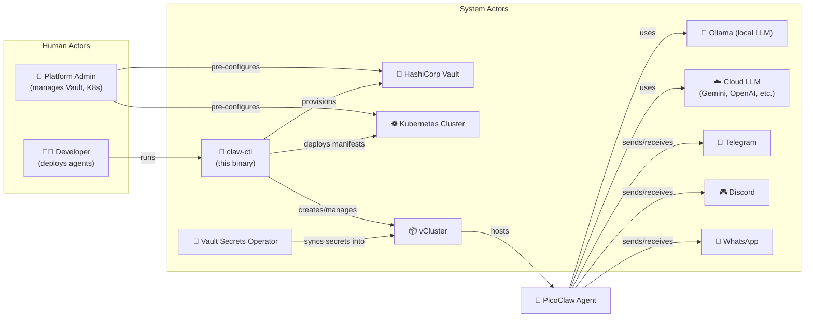
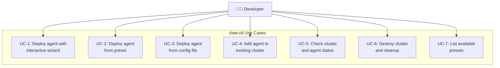
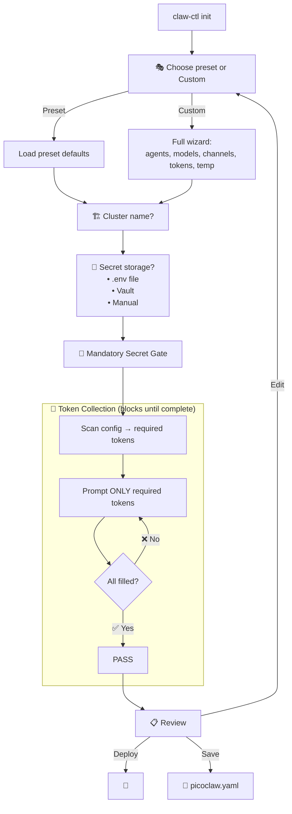
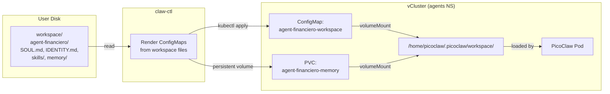

# `claw-ctl` — Solution Design

## Prerequisites

> [!IMPORTANT]
> **The only hard requirement to use `claw-ctl` is an LLM provider token or a local Ollama address.** Everything else is optional or handled by the CLI.

| Requirement | Required? | Examples |
|---|---|---|
| **LLM Access** | ✅ Mandatory | `GEMINI_API_KEY`, `OPENAI_API_KEY`, or `http://192.168.1.100:11434` (Ollama) |
| Kubeconfig | Optional | Uses `~/.kube/config` if present; can also deploy in Docker-only mode ⁽¹⁾ |
| Vault token | Optional | Only if `--vault-addr` is used |
| Channel tokens | Optional | Only if Telegram/WhatsApp/Discord channels are enabled |

⁽¹⁾ *Future: Docker-only mode for users without K8s cluster*

---

## Actors



---

## Use Cases



### UC-1: Deploy Agent with Interactive Wizard

| Field | Value |
|---|---|
| **Actor** | Developer |
| **Precondition** | Has an LLM token or Ollama address |
| **Trigger** | `claw-ctl init` |
| **Flow** | 1. Select preset or custom → 2. Name cluster → 3. Configure agents (model, channels) → 4. Secret Gate collects required tokens → 5. Review → 6. Deploy |
| **Postcondition** | vCluster running, agent pods healthy, secrets injected |

### UC-2: Deploy Agent from Preset

| Field | Value |
|---|---|
| **Actor** | Developer |
| **Precondition** | Has LLM token + knows desired preset |
| **Trigger** | `claw-ctl deploy finance --preset financial-controller` |
| **Flow** | 1. Load preset defaults → 2. Secret Gate prompts for required tokens → 3. Deploy |
| **Postcondition** | Agent running with preset config |

### UC-3: Deploy Agent from Config File

| Field | Value |
|---|---|
| **Actor** | Developer |
| **Precondition** | Has a `picoclaw.yaml` (created via wizard or manually) |
| **Trigger** | `claw-ctl deploy --config picoclaw.yaml` |
| **Flow** | 1. Parse config → 2. Validate completeness → 3. Secret Gate if tokens missing → 4. Deploy |
| **Postcondition** | Agent(s) running per config |

### UC-4: Add Agent to Existing Cluster

| Field | Value |
|---|---|
| **Actor** | Developer |
| **Precondition** | vCluster already running |
| **Trigger** | `claw-ctl add-agent finance agent-reportes` |
| **Flow** | 1. Detect existing cluster → 2. Wizard for new agent config → 3. Secret Gate → 4. Generate + apply new agent manifests → 5. Patch vCluster secret sync |
| **Postcondition** | New agent pod running alongside existing ones |

### UC-5: Check Status

| Field | Value |
|---|---|
| **Actor** | Developer |
| **Precondition** | vCluster exists |
| **Trigger** | `claw-ctl status finance` |
| **Output** | Cluster health, per-agent pod status, secret sync state, model info, channel connections |

### UC-6: Destroy Cluster

| Field | Value |
|---|---|
| **Actor** | Developer |
| **Precondition** | vCluster exists |
| **Trigger** | `claw-ctl destroy finance` |
| **Flow** | 1. Confirmation prompt → 2. Delete vCluster + NS → 3. Clean Vault (if used) → 4. Remove local config |
| **Postcondition** | All resources removed |

### UC-7: List Presets

| Field | Value |
|---|---|
| **Actor** | Developer |
| **Precondition** | None |
| **Trigger** | `claw-ctl presets` |
| **Output** | Table of presets with agents, models, channels |

---

## CLI Commands

| Command | Description |
|---|---|
| `claw-ctl init` | Interactive wizard (preset or custom) |
| `claw-ctl deploy <name> --preset <p>` | Deploy from preset |
| `claw-ctl deploy --config picoclaw.yaml` | Deploy from saved config |
| `claw-ctl destroy <name>` | Full teardown (vCluster + Vault) |
| `claw-ctl add-agent <cluster> <agent>` | Hot-add agent to running vCluster |
| `claw-ctl reload <cluster> [agent]` | Push workspace file changes (SOUL, skills, etc.) without restart |
| `claw-ctl status <name>` | Agent health, pod status, secret sync |
| `claw-ctl presets` | List available presets |

---

## Presets

| Preset | Agents | Model | Channels | Use Case |
|---|---|---|---|---|
| `financial-controller` | agent-financiero | qwen2.5-coder:14b | Telegram+HTTP | Expenses, budgets |
| `devops-engineer` | agent-devops | qwen2.5-coder:14b | Discord+HTTP | K8s, CI/CD |
| `personal-assistant` | agent-assistant | llama3.1:8b | Telegram+WhatsApp | Calendar, notes |
| `multi-team` | 3 agents | mixed | All | Full autonomous team |
| `minimal` | agent | llama3.1:8b | HTTP only | API-only agent |
| `custom` | — | — | — | Full manual wizard |

Presets are embedded YAML in the binary via `go:embed`. Users can also save custom presets with `claw-ctl init` → `[S]ave`.

---

## Wizard Flow with Mandatory Secret Gate



### Secret Requirement Matrix

| Condition | Required Token |
|---|---|
| Telegram enabled | `TELEGRAM_BOT_TOKEN` |
| WhatsApp enabled | `WHATSAPP_API_TOKEN` |
| Discord enabled | `DISCORD_BOT_TOKEN` |
| Cloud model (`gemini/*`) | `GEMINI_API_KEY` |
| GitHub MCP enabled | `GITHUB_ACCESS_TOKEN` |
| Ollama model | *none* |

> [!IMPORTANT]
> Deploy **will not start** until every required token is provided. The gate loops until complete.

---

## Config File (`picoclaw.yaml`)

```yaml
cluster: finance
preset: financial-controller
secrets:
  mode: env
  envFile: .env
agents:
  - name: agent-financiero
    model: ollama/qwen2.5-coder:14b
    maxTokens: 32000
    temperature: 0.1
    capabilities: [traefik, cnpg, redis]
    channels:
      telegram: { enabled: true, allowFrom: ["1498879396"] }
      http: { enabled: true }
    # Agent workspace value files (editable, reloadable)
    workspace:
      soul: workspace/agent-financiero/SOUL.md
      identity: workspace/agent-financiero/IDENTITY.md
      user: workspace/agent-financiero/USER.md
      agent: workspace/agent-financiero/AGENT.md
      environment: workspace/agent-financiero/ENVIRONMENT.md
      memory: workspace/agent-financiero/memory/
      skills:
        - workspace/agent-financiero/skills/financial-analyst/
        - workspace/agent-financiero/skills/github/
```

---

## Agent Workspace Files

Each agent has its own set of **editable value files** that define its personality, knowledge, and capabilities. These files live on disk, are version-controlled, and get mounted into the agent container via ConfigMaps.

### Workspace Directory Layout

```
workspace/
└── agent-financiero/
    ├── SOUL.md              # Personality, values, behavior rules
    ├── IDENTITY.md          # Name, version, purpose, capabilities
    ├── USER.md              # Info about the user (preferences, timezone)
    ├── AGENT.md             # Operational instructions, do's and don'ts
    ├── ENVIRONMENT.md       # K8s context, installed controllers, security rules
    ├── memory/
    │   ├── MEMORY.md        # Persistent facts the agent remembers
    │   └── *.md             # Additional memory files
    └── skills/
        ├── financial-analyst/
        │   └── SKILL.md     # Custom skill: expense tracking, reports
        ├── github/
        │   └── SKILL.md     # GitHub PR reviews, issues
        └── ...
```

### How Workspace Files Are Mounted



### File Behavior

| File | Storage | Editable | Reloadable | Purpose |
|---|---|---|---|---|
| `SOUL.md` | ConfigMap | ✅ Edit on disk, redeploy | ✅ `claw-ctl reload` | Personality, values |
| `IDENTITY.md` | ConfigMap | ✅ | ✅ | Name, purpose, version |
| `USER.md` | ConfigMap | ✅ | ✅ | User preferences |
| `AGENT.md` | ConfigMap | ✅ | ✅ | Operational rules |
| `ENVIRONMENT.md` | ConfigMap (generated) | ⚠️ Auto-generated by CLI | ✅ | K8s context, installed CRDs |
| `memory/` | PVC (persistent) | ✅ Agent writes here | Persists across restarts | Agent's learned facts |
| `skills/` | ConfigMap | ✅ | ✅ `claw-ctl reload` | Custom capabilities |

> [!TIP]
> `ENVIRONMENT.md` is **auto-generated** by the CLI based on what the cluster has installed (Traefik, CNPG, Redis, etc.). The others are fully user-controlled.

### Reload Without Redeploying

```bash
# Edit the soul file
vim workspace/agent-financiero/SOUL.md

# Push changes to the running agent (no restart needed)
claw-ctl reload finance agent-financiero

# Or reload all agents in a cluster
claw-ctl reload finance --all
```

The `reload` command updates the ConfigMaps in-place. PicoClaw watches for file changes and reloads its context automatically.

### Default Workspace (Generated by Wizard)

When using a preset or the wizard, `claw-ctl init` generates a default workspace with sensible files:

```bash
$ claw-ctl init
  ...
  ✅ Workspace generated at ./workspace/agent-financiero/
  📝 Edit SOUL.md and IDENTITY.md to customize your agent's personality.
```

## Deployment Lifecycle

```mermaid
sequenceDiagram
    participant User
    participant CLI as claw-ctl
    participant K8s as Host K8s
    participant Helm as Helm SDK
    participant Vault as Vault (optional)

    User->>CLI: claw-ctl deploy finance --preset financial-controller

    rect rgb(40, 40, 60)
    Note over CLI: Phase 1: Preflight
    CLI->>CLI: Validate kubeconfig connectivity
    CLI->>CLI: Secret Gate (collect tokens)
    CLI->>CLI: Generate all manifests from templates
    end

    rect rgb(40, 60, 40)
    Note over CLI,K8s: Phase 2: vCluster
    CLI->>K8s: Create NS vcluster-finance
    CLI->>Helm: Install vcluster chart (--connect=false)
    CLI->>CLI: Wait for vCluster readiness
    end

    alt Vault Mode
        rect rgb(60, 50, 40)
        Note over CLI,Vault: Phase 3a: Vault
        loop For each agent
            CLI->>Vault: Create KV path + Policy + Auth Role
            CLI->>K8s: Create SA + TokenSecret
            CLI->>K8s: Apply VaultConnection/Auth/StaticSecret CRDs
        end
        end
    else .env Mode
        rect rgb(50, 60, 40)
        Note over CLI,K8s: Phase 3b: Native Secrets
        loop For each agent
            CLI->>K8s: Create native K8s Secret from collected tokens
        end
        end
    end

    rect rgb(50, 40, 60)
    Note over CLI,K8s: Phase 4: Agent Deploy
    CLI->>K8s: vcluster connect (background)
    CLI->>K8s: Apply Namespace, RBAC, PVC, ConfigMap
    loop For each agent
        CLI->>K8s: Apply Deployment, Service, Ingress
    end
    CLI->>CLI: Health check (wait for pods Ready)
    end

    Note over User: ✅ All agents running
```



---

## What the CLI Generates (per agent)

All manifests are **embedded Go templates** rendered dynamically per agent config:

| Manifest | Purpose | Template Variables |
|---|---|---|
| `01-namespace.yaml` | `agents` NS | — |
| `02-rbac.yaml` | SA + Crystal Wall Role (deny secrets read, deny pods/exec) | `agentName` |
| `03-pvc.yaml` | Workspace persistence | `agentName` |
| `04-configmap.yaml` | `config.json` + `mcp_config.json` + `ENVIRONMENT.md` | `model`, `maxTokens`, `temperature`, `channels`, `allowFrom` |
| `06-deployment.yaml` | PicoClaw container | `agentName`, `image`, `secretName` |
| `07-service.yaml` | ClusterIP for gateway | `agentName` |
| `08-ingress.yaml` | Traefik ingress | `agentName`, `hostname` |
| `09-cluster-rbac.yaml` | ClusterRole for broader K8s access | `agentName` |
| `10-networkpolicy.yaml` | Network isolation | `agentName` |
| `vcluster.yaml` | vCluster config with `fromHost` secret mappings | `agents[]` |

---

## Crystal Wall RBAC (Embedded Template)

The CLI enforces the security model from `project_specifications.md`:

```yaml
# Generated per agent — deny secrets read, deny pods/exec
rules:
  - apiGroups: [""]
    resources: ["secrets"]
    verbs: ["create", "update", "delete"]  # NO get, list, watch
  - apiGroups: ["", "apps", "networking.k8s.io", "batch"]
    resources: ["pods", "deployments", "services", "ingresses", "jobs", "configmaps"]
    verbs: ["*"]
  - apiGroups: ["postgresql.cnpg.io"]
    resources: ["clusters", "scheduledbackups"]
    verbs: ["*"]
```

---

## Destroy Flow

`claw-ctl destroy finance` performs:

1. **vCluster**: `vcluster delete finance -n vcluster-finance`
2. **Host NS**: `kubectl delete ns vcluster-finance`
3. **Vault** (if Vault mode): Remove policies, auth roles, KV paths per agent
4. **Confirmation**: Interactive prompt before destructive action

---

## Go Package Structure

```
claw-ctl/
├── main.go
├── cmd/
│   ├── root.go              # Cobra root, global flags
│   ├── init.go              # Interactive wizard
│   ├── deploy.go            # Orchestrator (all phases)
│   ├── destroy.go           # Teardown
│   ├── add_agent.go         # Hot-add agent
│   ├── status.go            # Health + pod status
│   └── presets.go           # List presets
├── pkg/
│   ├── wizard/
│   │   ├── prompt.go        # Bubbletea TUI engine
│   │   └── secret_gate.go   # Mandatory token collection
│   ├── config/
│   │   ├── types.go         # ClusterConfig, AgentConfig, ChannelConfig
│   │   └── presets.go       # Embedded preset definitions
│   ├── vcluster/
│   │   └── manager.go       # Helm SDK: create, connect, delete, wait
│   ├── vault/
│   │   └── provisioner.go   # KV, Policy, Auth Role via Vault API
│   ├── secrets/
│   │   ├── vault_mode.go    # SA + TokenSecret + VSO CRDs
│   │   └── env_mode.go      # Tokens → native K8s Secret
│   ├── k8s/
│   │   └── client.go        # Kubeconfig loader, unstructured apply
│   └── manifests/
│       ├── renderer.go      # Template engine
│       └── embed/           # go:embed YAML templates
│           ├── namespace.yaml
│           ├── rbac.yaml
│           ├── pvc.yaml
│           ├── configmap.yaml.tmpl
│           ├── deployment.yaml.tmpl
│           ├── service.yaml
│           ├── ingress.yaml.tmpl
│           ├── cluster-rbac.yaml
│           ├── networkpolicy.yaml
│           └── vcluster.yaml.tmpl
├── go.mod
├── Makefile
└── .goreleaser.yaml
```

### Dependencies

| Package | Purpose |
|---|---|
| `github.com/spf13/cobra` | CLI framework |
| `github.com/charmbracelet/bubbletea` | Rich interactive TUI |
| `github.com/charmbracelet/lipgloss` | TUI styling |
| `github.com/hashicorp/vault/api` | Vault client (optional) |
| `k8s.io/client-go` | K8s API via kubeconfig |
| `k8s.io/apimachinery` | Unstructured CRD apply |
| `helm.sh/helm/v3` | vCluster chart management |
| `gopkg.in/yaml.v3` | Config file I/O |

---

## Release & Distribution

- **GoReleaser**: Cross-compile for `linux/amd64`, `linux/arm64`, `darwin/arm64`, `darwin/amd64`
- **GH Actions**: Build on push to main, attach binaries to GitHub Release
- **Install**: `curl -sSfL https://github.com/ai-agent-ship-it/agent-lab/releases/latest/download/claw-ctl_$(uname -s)_$(uname -m).tar.gz | tar xz`

---

## Verification Plan

| Test | Command | Expected |
|---|---|---|
| Preset deploy | `claw-ctl deploy test --preset minimal` | Single agent, HTTP only, no Vault |
| .env mode | `claw-ctl deploy test --preset financial-controller` | Secret gate collects tokens, creates native Secret |
| Vault mode | `claw-ctl deploy test --preset devops-engineer --vault-addr https://vault.reynoso.pro` | Creates KV + Policy + Role + VSO CRDs |
| Multi-agent | `claw-ctl deploy test --preset multi-team` | 3 agents isolated, each with own secret |
| Crystal Wall | `kubectl exec` into agent pod → try `kubectl get secrets` | ❌ Denied |
| Destroy | `claw-ctl destroy test` | NS + vCluster + Vault resources removed |
| Status | `claw-ctl status test` | Shows pod health, secret sync, model info |
